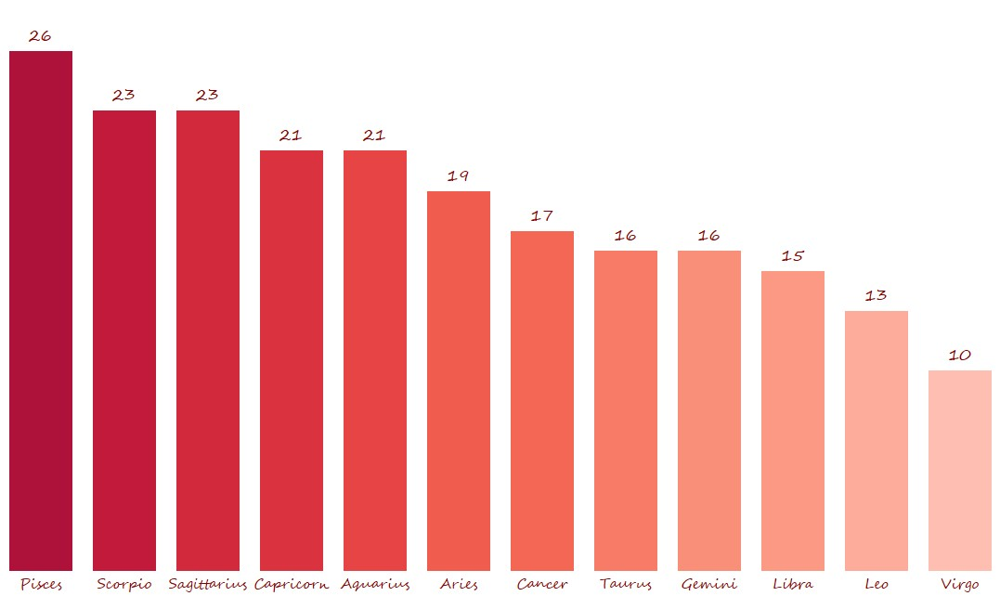

# 🔪 Global Analysis of Serial Killers

## Project Overview

Exploratory data analysis of serial killers worldwide — geography, victim counts, 
years active, birth decades, and zodiac signs.  
Data sourced from Kaggle (4 datasets), enriched manually via Wikipedia and Google Sheets,
visualized in Tableau.

---

## Data Pipeline

1. **Loaded 4 datasets from Kaggle** — checked shape of each file
2. **Merged** into a single DataFrame using `pd.concat()`
3. **Birth date enrichment** — extracted `birth_date`, `birth_day`, `birth_month`, 
   `birth_year` with GitHub Copilot; missing dates researched via Wikipedia and 
   verified manually in Google Sheets
4. **Feature engineering** in Python:
   - `victims_count` — parsed max possible victims
   - `victims_gap` — difference between possible and proven victims
   - `years_active_count` — calculated killers activity duration in years
   - `birth_decade` — grouped birth years by decade
   - `country_clean` — standardized country names via `country_converter`
   - `zodiac` — assigned zodiac sign based on birth day and month

---

## Tableau Dashboard

**[View on Tableau Public →](https://public.tableau.com/app/profile/yevheniia.panova/viz/GlobalAnalysisofSerialKillers/GlobalAnalysisofSerialKillers)**

Includes:
- **Total Killers** — 305
- **AVG Victims** — 17
- **Max Victims** — 138 (Luis Garavito)
- **AVG Years Active** — 7
- **Victim Distribution** — histogram of victim counts
- **Birth by Decade** — peak in 1950s–1960s (65 killers)
- **Top 10 Killers** by victim count
- **Killers by Country** — world map
- **Years Active** — activity duration distribution

---

## Bonus: Zodiac Analysis: Signal or Just Noise?

One of the exploratory questions in this project was whether zodiac signs show any meaningful pattern in the dataset.

At first glance, the distribution appears uneven — some signs seem slightly overrepresented, others underrepresented. However, visual patterns can be misleading, especially with relatively small samples.

To validate this, three statistical approaches were applied:

- **Chi-Square Test** — to check the overall distribution against a uniform expectation  
- **Binomial Test** — to evaluate individual zodiac deviations  
- **Bayesian Inference** — to estimate probability ranges for each sign  

### What the data actually shows

Across all three methods, the result is consistent:

- The overall distribution does **not significantly differ from uniform**
- Individual deviations fall within expected statistical variation
- Apparent “peaks” are explained by randomness rather than a real effect

### Insight

Despite initial visual patterns, there is **no statistical evidence** supporting any relationship between zodiac signs and behavioral outcomes in this dataset.

### Takeaway

This is a typical example of how:
- **patterns in data can emerge by chance**,  
- and why **statistical validation is essential before drawing conclusions**.

## Tools & Stack

| Tool | Usage |
|------|-------|
| Python / Pandas | Data cleaning & feature engineering |
| Google Colab | Development environment |
| Google Sheets | Manual data verification |
| Tableau | Visualization & dashboard |
| Claude AI | Birth date research & data enrichment |
| country_converter | Country name standardization |

---

## Files

- **Lessthan_5_victim_count.csv**  
  Dataset containing killers with fewer than 5 victims.
  
- **5_to_14_victim_count.csv**  
  Dataset containing killers with 5 to 14 victims.

- **15_to_30_victim_count.csv**  
  Dataset containing killers with 15 to 30 victims.

- **Highest_victim_count.csv**  
  Dataset of killers with the highest recorded victim counts.

- **Serial_killers_data.xlsx**  
  Combined and structured dataset used for analysis and feature engineering.

- **serials_killers1.ipynb**  
  Main notebook with data cleaning, preprocessing, and feature engineering.

- **zodiac.ipynb**  
  Notebook dedicated to zodiac analysis and statistical testing.

- **diagrama.jpg**  
  Tableau dashboard screenshot presenting key analytical insights, including distribution patterns, victim counts, and exploratory findings.

- **blood.jpg**  
  Visualization of zodiac distribution used in the analysis.

- **README.md**  
  Project documentation and overview.

---

## Data Source

[Kaggle — Serial Killers Dataset](https://www.kaggle.com/code/mohandamr/serial-killers/input)
