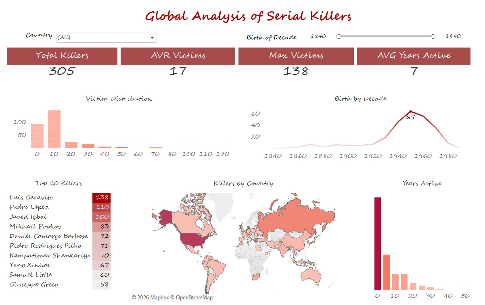

# 🔪 Global Analysis of Serial Killers

## Project Overview

Exploratory data analysis of serial killers worldwide — geography, victim counts, 
years active, birth decades, and zodiac signs.  
Data sourced from Kaggle (4 datasets), enriched manually via Wikipedia and Google Sheets,
visualized in Tableau.

---

## Data Pipeline

1. **Loaded 4 datasets from Kaggle** — checked shape of each file
2. **Merged** into a single DataFrame using `pd.concat()`
3. **Birth date enrichment** — extracted `birth_date`, `birth_day`, `birth_month`, 
   `birth_year` with GitHub Copilot; missing dates researched via Wikipedia and 
   verified manually in Google Sheets
4. **Feature engineering** in Python:
   - `victims_count` — parsed max possible victims
   - `victims_gap` — difference between possible and proven victims
   - `years_active_count` — calculated killers activity duration in years
   - `birth_decade` — grouped birth years by decade
   - `country_clean` — standardized country names via `country_converter`
   - `zodiac` — assigned zodiac sign based on birth day and month

---

## Tableau Dashboard

**[View on Tableau Public →](https://public.tableau.com/app/profile/yevheniia.panova/viz/GlobalAnalysisofSerialKillers/GlobalAnalysisofSerialKillers)**

Includes:
- **Total Killers** — 305
- **AVG Victims** — 17
- **Max Victims** — 138 (Luis Garavito)
- **AVG Years Active** — 7
- **Victim Distribution** — histogram of victim counts
- **Birth by Decade** — peak in 1950s–1960s (65 killers)
- **Top 10 Killers** by victim count
- **Killers by Country** — world map
- **Years Active** — activity duration distribution

---

## Bonus: Zodiac Analysis

*Just for fun* — distribution of serial killers by zodiac sign,  
calculated from birth day and month using a custom Python function.

---

## Tools & Stack

| Tool | Usage |
|------|-------|
| Python / Pandas | Data cleaning & feature engineering |
| Google Colab | Development environment |
| Google Sheets | Manual data verification |
| Tableau | Visualization & dashboard |
| Claude AI | Birth date research & data enrichment |
| country_converter | Country name standardization |

---

## Files
serials_killers.ipynb — основний Colab ноутбук  
combined.csv — об'єднаний датасет з Kaggle  
sk_with_births.xlsx — збагачений датасет з датами народження  
diagrama.jpg — скріншот Tableau дашборду  

---

## Data Source

[Kaggle — Serial Killers Dataset](https://www.kaggle.com/code/mohandamr/serial-killers/input)
